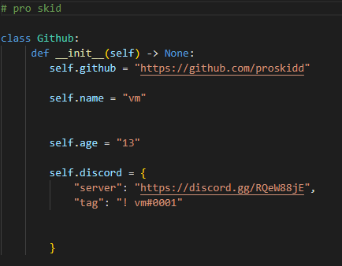

### Pro Skid  

<a href="https://github.com/proskidd/proskidd">
    

## **Socials**
    
<a href="https://discord.gg/RQeW88jE"><strong>Discord Server</strong></a>
    
<a href="https://lookup.guru/905989612814606356"><strong>Discord Profile</strong></a>
      

    
## **Statistics**
    

    

    

    
## **Languages**
- Python 
- Golang 
- Html 
- Css 

    
## **Tools**
- Visual Studio Code 
 
    
## **Checklist for 2022**
- [x] Be black
- [x] Get 50 Stars
- [x] Learn Golang
- [x] Get a job in Cyber gay
- [ ] Get 50 Repositories

    
## **Skids**
Learn to code 🤓

